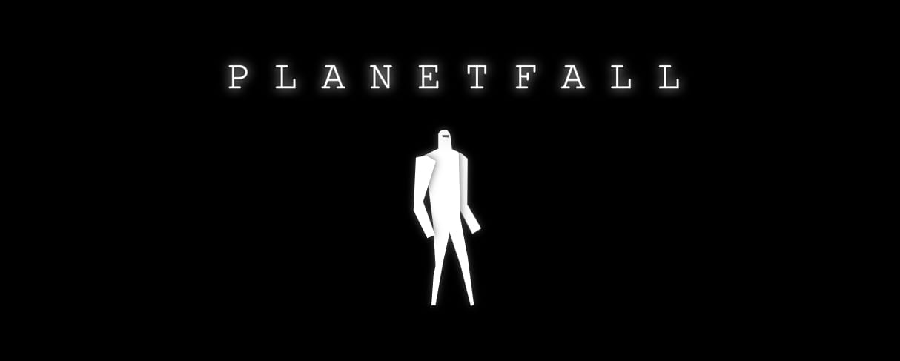
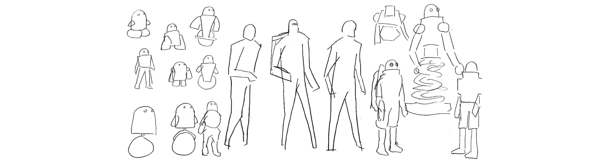
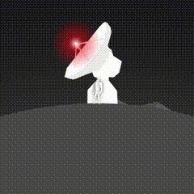
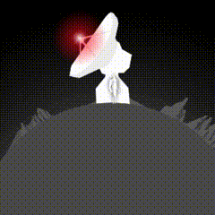
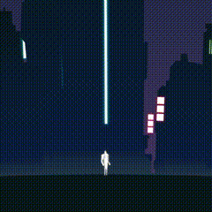
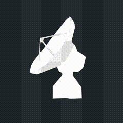
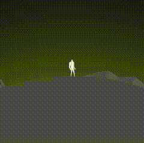

# Planetfall


In 2018, I participated in [js13kGames](https://js13kgames.com/), a game dev competition with a file size limit of 13kb.  My entry [Planetfall](https://js13kgames.com/entries/planetfall) is a space exploration game. The goal is to find satellite stations on each planet and take them offline.

You can play it here https://chiaogu.github.io/planetfall/  

## Concept


I was really into [Star Citizen](https://robertsspaceindustries.com/star-citizen) back then, especially the experience of seamlessly flying from a planet to another, landing without any loading screen. So when I decided to participate the js13kGames, the first idea that came to my mind was to reproduce that experience in a 2D platform game.

In the early stages of development, the character was only a rectangle. I thought it might be cool to simply let players play as the Monolith from *2001: A Space Odyssey*, but it was too difficult to express the idea of triggering evolution in this tiny game. It better be as easy as finding a treasure or turning a switch on.

To follow the competition's **offline** theme, the goal became shutting down the satellite stations. There was actually a background story like stopping a Skynet-like human killing AI to destroy the system. But it was better not to tell in the game to leave more space for imagination.

## Character


Since the player travels back and forth to outer space, the easiest way for it to make sense without building a spacecraft system is to make the character a robot. I was trying to make a cute droid like R2-D2 or WALL-E at first, but I found it was easier to put myself into the game when the character is humanoid.

## Planets


The initial idea was to procedurally generate planets, but it won't be attractive to explore if they all look the same. The first few planets must be very distinct from each other in terms of the landscape and color scheme.

I end up creating only 5 planets. They were all referencing from my favorite sci-fi classics and named with the help of [Planet name generator](https://www.fantasynamegenerators.com/planet_names.php).
- Aolea - A cyberpunk style world completely covered by buildings, inspired by *Blade Runner*
- Catlax - The moon of Aolea, a tutorial planet for players to get familiar with the launch and landing
- Kapbula - A desert planet inspired by *Dune*
- Nadium - A forest planet inspired by *Return of the Jedi*
- Eskiri - A ice planet inspired by *The Empire Strikes Back*

## Mechanics

In addition to the main goal of finding satellite stations, some mechanics are making the game more challenging:
 - Velocity - You must control the speed carefully before landing to avoid the crash
 - Energy - The fuel is limited after takeoff, you can only refuel on a planet
 - Navigation - The biggest difficulty of finding the direction came from space exploration itself, the purpose of the radar system was to balance it. Players can determine the distance and direction of the satellite station by observing and listening to the echoes. The higher the pitch, the closer to the target.

## Implementation

### Movement


There are 2 movement modes in the game. When you enter the atmosphere and get caught by the gravity, the direction is relative to the planet. Down is the direction gravity is pulling you, left and right is perpendicular to the gravity vector.

But when you are in space, there is no significant gravity pulling, so there is no up and down. You can only thrust forward or backward and rotate clockwise or counterclockwise. It is tricky to get used to at first, but it's closer to the experience of floating in space when the whole world is spinning around you.

```javascript
const character = { x, y, rotaion, vX, vY, vRotaion };

function onPressRight() {
  const closetPlanet = findClosetPlanet();
  const distance = getDistanceToPlanetSurface(closetPlanet);
  const isInAtmosphere = distance < planet.radius;
  if (isInAtmosphere) {
    const gravityAngle = getAngle(planet, character) * Math.PI / 180;
    character.vx += A_MOVEMENT * Math.cos(gravityAngle);
    character.vy += A_MOVEMENT * Math.sin(gravityAngle);
  } else {
    character.vRotaion += A_ROTAION;
  }
}
```

### Camera


Usually in a platform game, the coordinate system of the canvas and game world is the same, up is always up and down is always down. But planets are round, it is confusing when players walk along the surface to the south pole and the character becomes upside down. Does pressing "**←**" means moving to the player's left or character's? Should players press "**↓**" or "**↑**" to jump?

Instead of having an absolute coordinate system, we need to rotate the camera with the character, so player's up is always character's up. This is the function to transform all the coordinates from game world to the canvas:

```javascript
function transform({ x, y }) {
  const rotation = (camera.rotation * Math.PI) / 180;
  const canvasCenter = { x: window.innerWidth / 2, y: window.innerHeight / 2 };
  return {
    x:
      canvasCenter.x +
      (x - camera.x) * Math.cos(rotation) * camera.zoom -
      (y - camera.y) * Math.sin(rotation) * camera.zoom,
    y:
      canvasCenter.y +
      (x - camera.x) * Math.sin(rotation) * camera.zoom +
      (y - camera.y) * Math.cos(rotation) * camera.zoom
  };
}
```

### Data Struture
 

The data structure of a planet is pretty straightforward. It describes not only its location, size, and gravity, but also how it looks and what's on it. 

```javascript
{
  name: 'Aolea',
  x: 0,
  y: 2020,
  radius: 2000,
  gravity: 0.05,
  color: {
    land: '#091A1E',
    atmosphere: [[0, '#4F3C6A'], [0.1, '#0E2A48']]
  },
  objects: [[30, OBJECT_SATELLITE_STATION, false]],
  bgs: [
    [2, 0, OBJECT_BUILDING, 1.75, 0.7],
    [6, 3, OBJECT_BUILDING_2, 2.75, 0.6],
    [3, 2, OBJECT_BUILDING, 2.25, 0.5],
    [6, 3, OBJECT_BUILDING_2, 3.25, 0.3]
  ]
}
```

`color.atmosphere` defines how colors arranged in the gradient.

`objects` defines things on the planet. Although I end up only putting a satellite station, I was planning to put more interactable things at first. The parameters of an object will be destructured to `latitude`, `objectId` and the rest are the state of that object instance. For a satellite station, it is either on or off, so there is only a boolean.

```javascript
planet.objects.forEach(([latitude, id, ...state]) => {}
``` 

`bgs` defines layers of background images, it is similar to `objects` but it repeats itself along the planet's surface.

```javascript
planet.bgs.forEach(([gap, offset, id, scale, distance, ...params]) => {}
```

- `gap` - The space between repeated images
- `offset` - The horizontal offset of the layer
- `scale` - The size of the images in the layer
- `distance` - Determines the moving speed of the layer, used to create the illusion of depth with parallax effect


### Graphic Assets


All the graphic assets in the game are vector graphics defined in JSON format. It is an array of shape layers, each layer contains the color of the shape and the path defining the shape. The satellite station above takes about 800 bytes before zipped.

```javascript
[
  { 
    color: '#fff',
    paths: [[7.2, -49.4], [4.8, -47], ...]
  },
  { 
    color: '#eee',
    paths: [[8.5, -50], [9, -44.2], ...]
  },
  {
    color: '#eee',
    paths: [[-10.8, -22.2], [-9.8, -36.8], ...]
  }
]
```

### Sound


There are two types of sound in the game and both are interactive.  

The radar sound was made by a sine wave oscillator and a basic reverb effect. The frequency of the oscillator was adjusted according to the distance to the satellite station. The higher the pitch means the closer to the target.

```javascript
const oscillator = audioContext.createOscillator();
const reverb = audioContext.createConvolver();
oscillator.connect(reverb);
reverb.connect(audioContext.destination);
const frequency = 880 - 440 * getTargetDistanceInPercentage();
oscillator.frequency.setValueAtTime(frequency, audioContext.currentTime);
```

The engine sound is just white noise. Since you can't hear anything in the space, I added a low-pass filter to simulate the feeling of the air getting thinner. The higher you get the lower the cutoff frequency of the filter.

```javascript
const whiteNoise = audioContext.createBufferSource();
const filter = audioContext.createBiquadFilter();
whiteNoise.connect(filter);
filter.connect(audioContext.destination);
const frequency = 250 + 250 * getPlanetDistanceInPercentage();
filter.frequency.setValueAtTime(frequency, audioContext.currentTime);
```

## Final Thoughts
It is exciting and satisfying to develop ideas and put them into action. As the implementation progresses, more and more new ideas will be inspired. But what is hard is to converge those ideas before burning out. The competition provides a limited scope and schedule, force you to allocate the effort more cautiously to make the game playable. 

It is a great opportunity to have experts and other developers giving you feedback, knowing how people play your game is helpful. Also there are so many interesting ideas and techniques you can learn from other entries. It was worthy to participate in js13kgames.

